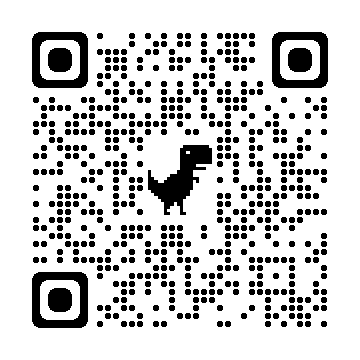

# Gemini Local Hub

**Gemini Local Hub** is a **Next.js application** that fronts [`@google/gemini-cli-core`](https://www.npmjs.com/package/@google/gemini-cli-core)—the same engine as the Google Gemini CLI—and exposes it as a **local HTTP API** plus a chat UI.

## Why run it locally?

### Process warmth (fast automation)

Each plain `gemini` CLI invocation pays a **cold-start cost** (process boot, OAuth/session handling, model discovery). The Hub keeps **warm `GeminiClient` instances** in a process-wide registry keyed by trusted project directory, so follow-up requests from **bash scripts, editors, or other tools** avoid that boot tax. Pair this with **`POST /api/chat/start`** (or the `examples/connect.sh` helper) to warm a session before you fire prompts.

### Free local multimodal API (via your CLI auth)

Authentication follows the **Gemini CLI**: sign in with `gemini login` (or your existing CLI OAuth). The Hub does not ship its own API keys; it reuses the CLI core against your account. It also normalizes **multimodal** input: multiple images are **stitched server-side** into a single composite when required by the model/API constraints, with prompts adjusted so vision is used directly.

In short: **one long-lived local process**, **OAuth via the official CLI stack**, **HTTP in / multimodal out**—optimized for developers who want **repeatable, low-latency** local automation.

## What you get

| Capability | Summary |
|------------|---------|
| **Stateful sessions** | Conversation state and CLI session live across HTTP requests (singleton registry per trusted folder + optional `sessionId`). |
| **Tool execution** | **YOLO mode** runs tools on the server and continues the agentic loop; otherwise the stream pauses for approval (UI or `POST /api/chat/tool`). |
| **Ephemeral turns** | `ephemeral: true` clears history before a request—ideal for one-shot scripts (e.g. commit message generation) without polluting chat. |
| **Streaming** | Long-lived responses emit **newline-delimited JSON** events (`Content-Type: application/x-ndjson`) when streaming is enabled. |
| **Trust model** | Only **trusted** absolute `folderPath` values are accepted; manage trust via `/api/registry/*`. |

## Stack (high level)

- **Next.js** (App Router) — API routes under `app/api/**/route.ts` and the Hub UI.
- **`@google/gemini-cli-core`** — model, tools, and streaming pipeline.
- **`sharp`** — image stitching for multi-image prompts.

For **install steps, endpoint reference, YOLO/ephemeral details, and script integration**, see **[USAGE.md](./USAGE.md)**.

### Get the Code
Scan the QR code below to view the repository:

---

MIT License | Built for high-speed, local-first AI development.
